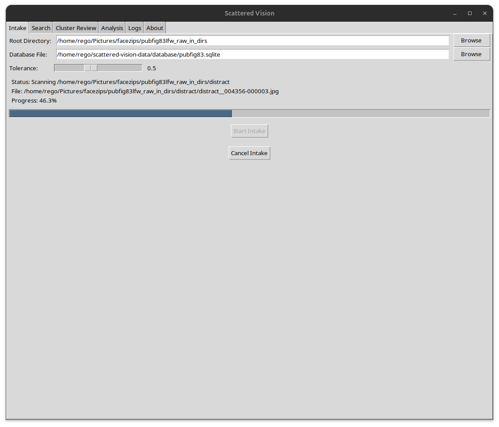
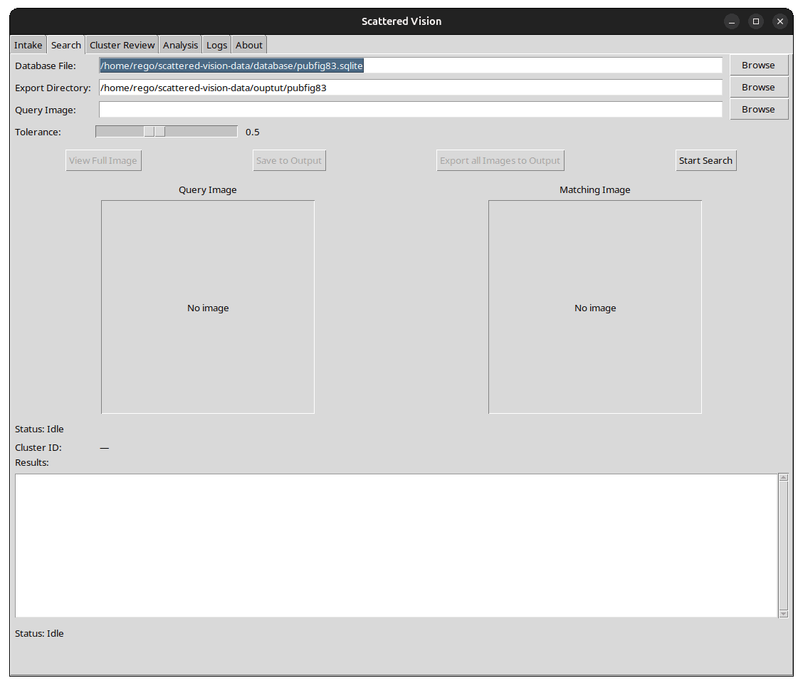
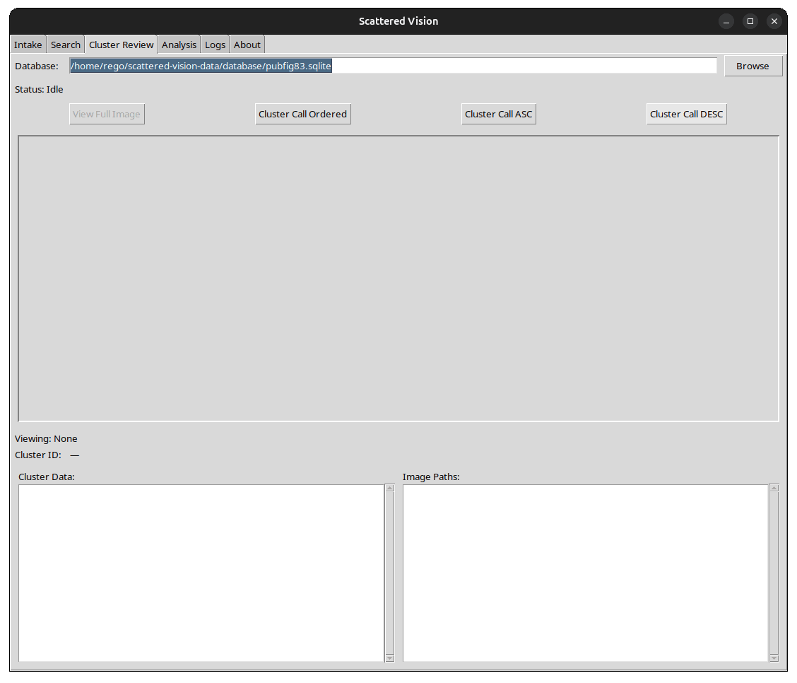
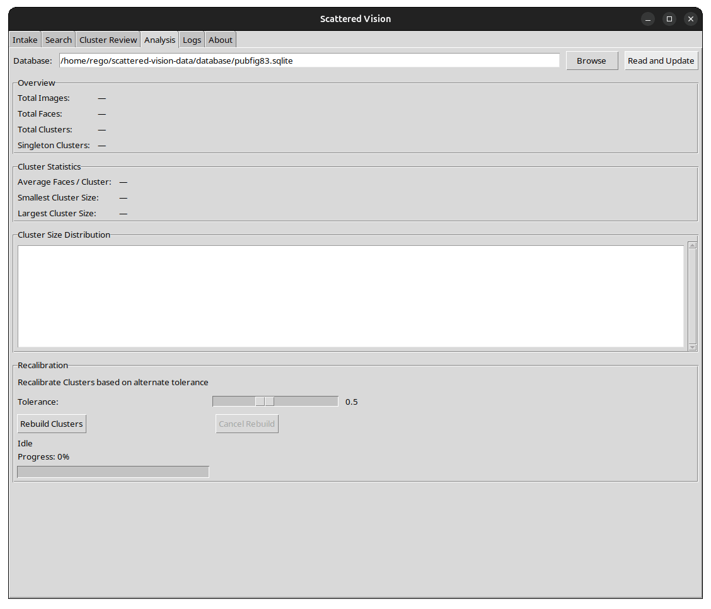

# Scattered Vision v1

A Self Hosted Local Facial Recognition Database and Search Application

Ian Hill, 2026

This program is FREEWARE provided for NON COMMERCIAL use. This program is provided with NO WARRANTY.

This program is made for Ubuntu Linux Systems and leverages the face_recognition python library by Adam Geitgey.

The application stores facial encodings and cluster relationships locally in a SQLITE database.

Essential config file:
Find the configuration file for default directory, database, and export locations at

` /home/USER/.scatteredvision/config.json.`

__General Premise:__
Scattered Vision is a GUI tool that enables a user to scan one or multiple directories for image files containing faces. 

The application allows for facial recognition encoding, automatic cluster association of 'like-faces', searching for like faces by supplying an image file of a given face, review of cluster associations for like faces, an analysis of the database and cluster data, recalibration of clusters based on tolerance sensitivity, and log review for process review.

Each file scanned has an MD5 hash generated at scan time, which is checked against the files already in the database. If a duplicate file exists, Scattered Vision will not scan duplicate files for faces, but will skip those files.
Note that image viewing necessarily requires that the user have access to the same file path resources as scanned in the INTAKE phase.

NOTE ON TOLERANCE SETTINGS:
TOLERANCE is a value used in face_recognition to determine the strictness of face encoding matches for search and cluster generation.
With TOLERANCE a LOWER value is MORE STRICT and a HIGHER VALUE is LESS STRICT.
The default value in Scattered Vision is set to 0.5. The default value in face_recognition samples is set to 0.6. A value of 0.3 is considered 'high security' level sensitivity. A value of 0.7 is broad matching, often beyond common likeness.

Scattered Vision v1 is not an optimized application. It does not use GPU acceleration for intake.

## Installation:

        Run setup_venv.sh
        Activate venv with 'source venv/bin/activate'
        Invoke Scattered Vision from the venv with command 'scatteredvision'

The sample files for these images were generated from the PubFig83 datasets from Brian C. Decker:
(https://www.briancbecker.com/blog/research/pubfig83-lfw-dataset)

## ----INTAKE

The INTAKE tab is the default starting tab when Scattered Vision starts. It is used to create or add to a database on which the rest of the application depends.

__ROOT DIRECTORY__ is the starting location where image files with faces will be scanned. Scanning is recursive.

__DATABASE FILE__ is the database file to be generated or appended.

__TOLERANCE__ slider sets the default tolerance value for cluster generation.

__START INTAKE__ begins the intake process by calculating the number of files in the ROOT DIRECTORY and the recursive directories and performing intake processing on images.

__CANCEL INTAKE__ will stop the intake process.

### -WORKFLOW:

- Select/Confirm appropriate root directory.
- Select/Confirm appropriate database file.
- Select/Confirm desired Tolerance.
- Click START INTAKE.
- Observe process with status indicators until complete.
- Review LOGS as necessary.

_NOTE: A user may perform multiple intake processes across a variety of directory locations to build one large database._

## -----SEARCH

The SEARCH tab allows one to search the database for images containing a face based on likeness. A user may set tolerance threshold, review results in a preview pane or a pop-up image viewer with pan/zoom function, export a single image, or export all images. 

__DATABASE FILE__ is the generated database file to be used.

__EXPORT DIRECTORY__ is the location where search results will be OUTPUT when a user chooses to do so.

_NOTE: the file name of the image being searched will serve as a directory for the search results under the specified Export Directory (ie /home/USER/ExportDir/smile.jpg/file1,2,3,4...)_

__QUERY IMAGE__: The directory path to the image to search for. The BROWSE button on the right will help facilitate file system selection.

*NOTE: This image MUST have a face that face_recognition can 'identify' with encodings. This should be a high quality image of a subject's face. Cropping to face only is advised*

__TOLERANCE__ slider sets the tolerance of the search.

__VIEW FULL IMAGE__ will open a pop-up image viewer with pan/zoom functionality of a selected return image. 

__SAVE TO OUTPUT__ will save the single selected file to the output location.

__EXPORT ALL IMAGES TO OUTPUT__ will save all returned images to the output location.

__START SEARCH__ performs a face encoding and checks against entries in the database.

### -WORKFLOW:

- Select/Confirm appropriate database.
- Select/Confirm desired export directory.
- Type the path of search image or BROWSE to populate QUERY IMAGE field.
- The Search Image will populate the QUERY IMAGE preview pane.
- Confirm desired image.
- Confirm TOLERANCE preference.
- Click START SEARCH.
- Wait for response with STATUS indicator.
- RESULTS box will populate with matches.
- Select an entry in the results to populate the MATCHING IMAGE preview pane.
- Choose to VIEW FULL IMAGE, SAVE TO OUTPUT, EXPORT ALL as desired.

## ----CLUSTER REVIEW

The CLUSTER REVIEW tab is used to review relationships of images based on tolerance. When properly calibrated, this feature may allow a user to identify like faces or pictures with common subjects. This tab allows a user to sort and order clusters and review their contents images.

__DATABASE__ is the current database to use.

__CLUSTER CALL ORDERED__ performs a check of the database in First-In order, by database ID.

__CLUSTER CALL ASC__ returns clusters in ascending order (least to highest). 

__CLUSTER CALL DESC__ returns clusters in descending order (highest to least).

### -WORKFLOW:
- Confirm Database.
- Select ordering preference.
- When database query completes, CLUSTER DATA panel will populate.
- Select a cluster from the CLUSTER DATA panel to populate the IMAGE PATHS panel with entries from the selected cluster.
- Select a file from IMAGE PATHS to populate the preview panel with a given image.

## ----ANALYSIS

The Analysis tab allows review of statistics of the database and recalibration of the tolerance value in cluster determination.

### ANALYSIS:
__DATABASE__ is the working database.

__READ AND UPDATE__ button reads the database and populates/updates the data fields on the screen.

### RECALIBRATION:
Recalibration destroys the cluster relationships from the INTAKE process and rebuilds clusters based on a new tolerance value. This does not require rescan of image files. Use this to fine tune cluster accuracy.

###	-WORKFLOW:

- Set TOLERANCE.
- Select REBUILD CLUSTERS.
- A popup will verify destructive action, Confirm intent.
- Wait for rebuild to complete.

## ----LOGS

Scattered Vision does not have any external log write tool. Activity processes are tracked as raw emit function output and are reported in the LOGS tab. The LOG tab is truncated at 500 lines.

